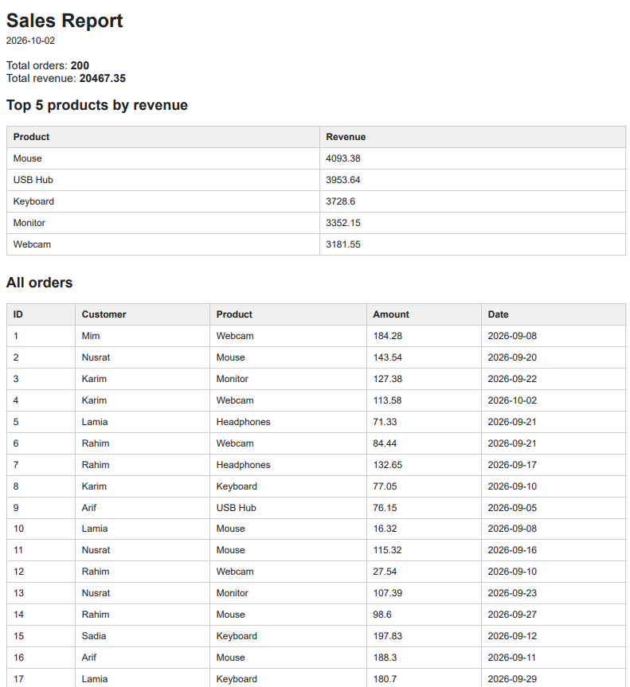

# PDF Report Generator

A backend service that turns database rows into a downloadable PDF report. It queries SQLite with SQL aggregation, renders the results into an HTML template, prints the page to PDF with headless Chromium (Playwright), stores the file on disk, and serves it by link.

## Overview

- **Dataset:** Option A, a small shop. The `orders` table holds 200 seeded orders from the last 30 days.
- **Report contents:** total orders, total revenue, top 5 products by revenue, orders per day for the last 7 days, and a full order table.
- **Design rule:** store and link. The PDF is saved on disk and only its address is passed around. JSON responses never carry the file bytes.

## Tech Stack

- Node.js 22+ and Express
- SQLite via the built-in `node:sqlite` module
- Playwright (headless Chromium) for HTML to PDF

## Getting Started

```bash
npm install
npx playwright install chromium
npm run seed
npm start
```

The server runs at `http://localhost:3000`. Running `npm run seed` more than once is safe: it deletes all rows first, so the table always ends with 200 orders.

## API

| Method | Endpoint | Description |
| --- | --- | --- |
| `GET` | `/health` | Health check. |
| `POST` | `/reports` | Generates a report. Returns `201` with an id and file link. If a report was already generated today, returns `200` with the existing id. Send `{ "force": true }` to generate a new one. |
| `GET` | `/reports/:id` | Returns the report record. Unknown id returns `404`. |
| `GET` | `/reports/:id/file` | Downloads the PDF. |

```bash
curl -i -X POST http://localhost:3000/reports
curl -i http://localhost:3000/reports/1
curl -o my-report.pdf http://localhost:3000/reports/1/file
```

## Aggregation SQL

```sql
SELECT COUNT(*) AS totalOrders, ROUND(SUM(amount), 2) AS totalRevenue
FROM orders;

SELECT product, ROUND(SUM(amount), 2) AS revenue
FROM orders
GROUP BY product
ORDER BY revenue DESC
LIMIT 5;

SELECT created_at AS day, COUNT(*) AS orders
FROM orders
WHERE created_at >= date('now', '-6 days')
GROUP BY created_at
ORDER BY created_at;
```

## Proof of Work

### Generate and download

```text
<paste the output of: time curl -i -X POST http://localhost:3000/reports>
<paste the output of: curl -o my-report.pdf http://localhost:3000/reports/1/file>
```

### Duplicate requests produce one report

Two rapid POST requests returned the same id and created exactly one new file.

```text
<paste both responses>
```

## Design Notes

**Moving generation out of the request.** <paste your Stage 4 sentence>

**Duplicate request protection.** <paste your two Stage 5 sentences>

## Sample Output


